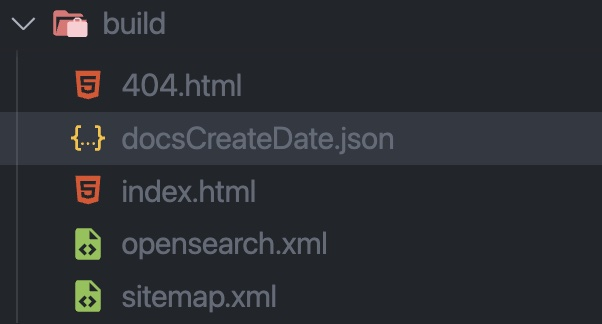

# docusaurus-plugin-get-docs-create-date

<div align="center">


</div>

This is the Docusaurus plugin to get the create date of the docs.

## Installation

```bash
npm install docusaurus-plugin-get-docs-create-date
```

## Usage

Add the plugin to your `docusaurus.config.js`:

```javascript
module.exports = {
  plugins: ["docusaurus-plugin-get-docs-create-date"],
};
```

and when you build the site, the create date of the docs json file will be created in the `build` directory as `docsCreateDate.json`.



<br/>

The data structure of the `docsCreateDate.json` is:

```json
[
  {
    "path": "/docs/docusaurus/intro.mdx",
    "date": "2023/05/07",
    "timestamp": 1683439283000
  },
  ...
]
```

- `path`: the path of the docs in your site.
- `date`: the create date of the docs. (format: `yyyy/mm/dd`)
- `timestamp`: the timestamp of the create date.

You can use the create date of the docs in your site.

```javascript
async function fetchDocs() {
  try {
    const res = await fetch("./docsCreateDate.json");
    const data = await res.json();
    return data;
  } catch (err) {
    console.error(err);
    return [];
  }
}
```

## Contributing

Contributions are welcome! Please feel free to submit a Pull Request.
